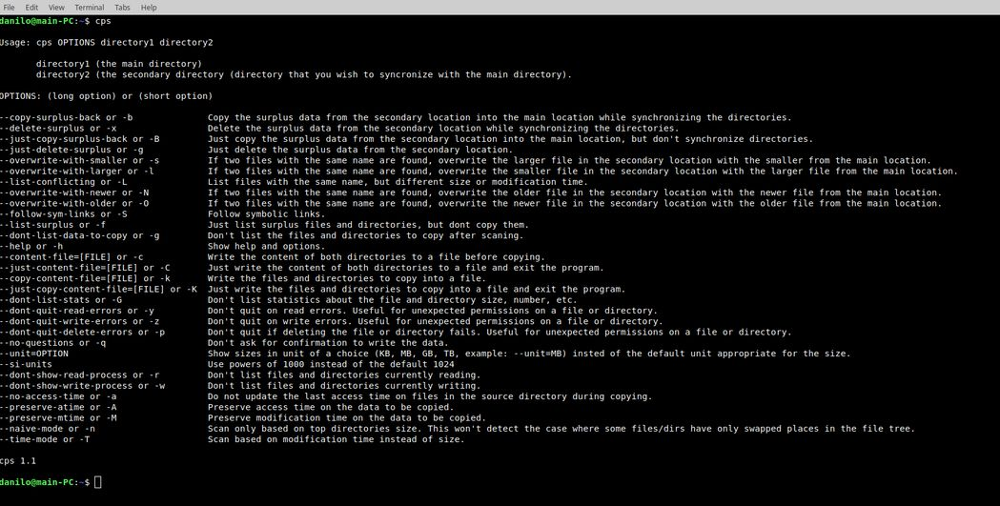

cps compares and syncronizes two directories by copying only the missing files and directories, but also enables you to overwrite the same files of different size or different last modification time, as well as to copy or delete any surplus data. It provides very useful information in it's statistical output after scanning and enables you to see the list and size of the files and directories to be copied before actually commencing the copying operation. It also allows you to create a text file with the list of all the files and directories that are about to be copied without actually copying anything. The program recognizes when two directories are on different disks and will read the contents of the two directories simultaneously during the scanning.  

By default, the program compares files based on their size, but you can suppy the option to compare them based on their last modification time. 

For help, run the program without any arguments or --help, -h.

Build and install:
```
./configure
make
sudo make install
```

Some examples of use:

```
cps OPTIONS directory1 directory2
```

1. To copy missing files and directories from **directory1** (the main directory or source) to **directory2** (the secondary directory or destination), you don't have to supply any options. For example:

```
cps /home/user/Documents/photos/2023 /mnt/backup/photos/2023
```
After you are asked if you want to copy missing files and directories, answer yes to begin copying operation or no if you want to quit. Use the -q option if you don't want to be asked for the confirmation. 

The program doesn't differentiate whether the pathnames end with a '/' or not. Whether you type **/mnt/backup/photos/2023** or **/mnt/backup/photos/2023/** - it is the same.

2. To copy missing files and directories from **directory1** (the main directory or source) to **directory2** (the secondary directory or destination) and to also copy surplus files and directories from **directory2** to **directory1**
```
cps --copy-surplus-back /home/user/Documents/dir1 /home/user/Documents/dir2
```
or using the short option:
```
cps -b /home/user/Documents/dir1 /home/user/Documents/dir2
```
After you are asked if you want to copy missing files and directories, answer yes to begin copying operation or no if you want to quit. Then you will be asked: Do you want to write the surplus data from the destination directory back to the source? 
Again, type yes or no if you changed your mind. Typing 'no' to a second question won't abort the result of the previous question/operation. 

Surplus files and directories are identified in the statistical output of the program even during default operation of the program, for example:
```
Number of surplus files: 464
Size of surplus files in bytes: 627106671
Size in megabytes: 598.06 MB
Number of surplus directories: 0
Size of surplus directories in bytes: 0
```
This way you know that the **secondary directory or destination** contains surplus data, and you can ignore it, copy it back to a **main directory** or delete it.

If you want list out such files without neccesarily copying them use --list-surplus or -f option.

3. To copy missing files and directories from **/home/user/Documents/dir1** to **/home/user/Documents/dir2** and to delete files and directories from **/home/user/Documents/dir2** that don't exist in 
**/home/user/Documents/dir1**:
```
cps --delete-surplus /home/user/Documents/dir1 /home/user/Documents/dir2
```
or using the short option:
```
cps -x /home/user/Documents/dir1 /home/user/Documents/dir2
```
After you are asked if you want to copy missing files and directories, answer yes or no if you don't want to. Then you will be asked: Do you want to delete the surplus data from the destionation directory back to the source? 
Answer yes, or no if you don't want to. Typing 'no' to a second question won't abort the result of the previous question/operation. 

4. If you want to add new data from a directory2 (destination) to a directory1 (source) without copying (syncing) data to a directory2 from a directory1, specify --just-copy-surplus-back or -B. 
```
cps --just-copy-surplus-back /home/user/Documents/dir1 /home/user/Documents/dir2
```
or using the short option:
```
cps -B /home/user/Documents/dir1 /home/user/Documents/dir2
```

5. cps copies only the missing files and directories from directory1 to a directory2 and ignores the files with the same name, but different size or different modification time (in case you use -T or --time-mode option). 
To list out any such files and directories, use:
```
cps --list-conflicting /home/user/Documents/dir1 /home/user/Documents/dir2
```
or using the short option:
```
cps -L /home/user/Documents/dir1 /home/user/Documents/dir2
```

If you want to overwrite such files, you must specify whether you want to overwrite the smaller files from the directory2 (destination) with the larger files from directory1 (source):
```
cps --overwrite-with-larger /home/user/Documents/dir1 /home/user/Documents/dir2
```
using the short option:
```
cps -l /home/user/Documents/dir1 /home/user/Documents/dir2
```
or if you want to overwrite the larger files from the directory2 (destination) with the smaller files from the directory1 (source):
```
cps --overwrite-with-smaller /home/user/Documents/dir1 /home/user/Documents/dir2
```
using the short option:
```
cps -s /home/user/Documents/dir1 /home/user/Documents/dir2
```
Such files are identified in the statistical output of the program even during the default (without any additional options) operation of the program:
```
Same files with different size (main location smaller): 6
Same files with different size (main location larger): 7
Same files with different modification time (main location newer): 0
Same files with different modification time (main location older): 0
```
In case you want to scan based on files last modification time, you must use --time-mode or -T option:

```
cps -T /home/user/Documents/dir1 /home/user/Documents/dir2
```

Such files are identified in the statistical output of the program with the -T or --time-mode option supplied:

```
Same files with different size (main location smaller): 0
Same files with different size (main location larger): 0
Same files with different modification time (main location newer): 22
Same files with different modification time (main location older): 1599
```

To overwrite the older modification time files in the secondary/destination location with the newer files from the main/source location, use --overwrite-with-newer or -N option:
```
cps -N /home/user/Documents/dir1 /home/user/Documents/dir2
```

To overwrite the older modification time files in the secondary/destination location with the newer files from the main/source location, use --overwrite-with-older or -O option:
```
cps -O /home/user/Documents/dir1 /home/user/Documents/dir2
```
6. Time options:

To preserve the last access time on the data to be copied use --preserve-atime or -A
```
cps -A /home/user/Documents/dir1 /home/user/Documents/dir2
```
To preserve the last modification time on the data to be copied use --preserve-mtime or -M
```
cps -M /home/user/Documents/dir1 /home/user/Documents/dir2
```
To avoid updating the last access time on files during reading operation use --no-access-time or -a
```
cps -a /home/user/Documents/dir1 /home/user/Documents/dir2
```

7. If you don't want to be asked whether or not you want to copy/overwrite/delete data, you can specify --no-questions or -q option. cps then proceeds with the desired operations immediately after scaning the directories.
```
cps -q /home/user/Documents/dir1 /home/user/Documents/dir2
```
8. If you want to know what will be copied, you can just print out the list of files that will be copied without actually coping anything. It is also useful in case there are many files and directories listed out and screen scrolls too fast. Specify the full pathname for the location of the copy-content file and name of the file.

option --just-copy-content-file=/path/to/file. /path/to/file is a desired pathname of your choice, or using short option -K
```
cps --just-copy-content-file=/home/user/Documents/copy_list /home/user/Documents/dir1 /home/user/Documents/dir2
```
or using the short option:
```
cps -K /home/user/Documents/copy_list /home/user/Documents/dir1 /home/user/Documents/dir2
```
You can also copy data and create file with the content of all directories copied. In that case use:
```
cps --copy-content-file=/home/user/copy_content /home/user/Documents/dir1 /home/user/Documents/dir2
```
or using short option:
```
cps -k /home/user/Documents/copy_list /home/user/Documents/dir1 /home/user/Documents/dir2
```
9. You can list complete content of files and directories from both **directory1 (source)** and **directory2 (destination)** without copying anything. use option --just-content-file=/path/to/file where /path/to/file is a desired pathname 
of your choice and name of the file.
```
cps --just-content-file=/home/user/dir_content /home/user/Documents/dir1 /home/user/Documents/dir2
```
or using the short option:
```
cps -C /home/user/Documents/copy_list /home/user/Documents/dir1 /home/user/Documents/dir2
```
You can also copy/syncronize the data and create a file with a complete directory content of both source and destination directories using --content-file or -c option:
```
cps --content-file=/home/user/dir_content /home/user/Documents/dir1 /home/user/Documents/dir2
```
or using the short option:
```
cps -c /home/user/Documents/copy_list /home/user/Documents/dir1 /home/user/Documents/dir2
```
10. By default, the program outputs all files and directories to copy along with their current pathname, new pathname and size in bytes. If you don't want any of that, use --dont-list-data-to-copy or -d:
```
cps -d /home/user/Documents/dir1 /home/user/Documents/dir2
```
11. By default, if program encounters a file or directory for which it doesn't have read or write permissions, it will quit. To skip over such files for read and write errors using short options, use:
```
cps -yz /home/user/Documents/dir1 /home/user/Documents/dir2
```
 
12. By default, program outputs sizes in bytes and another appropriate unit determined by the program. If you want to choose different second unit, use --unit option. For example, to output the size in megabytes:
```
cps --unit=MB /home/user/Documents/dir1 /home/user/Documents/dir2
```
13. By default, the program compares files based on their size. To compare then based on last modification time, use --time-mode or -T:

```
cps -T /home/user/Documents/dir1 /home/user/Documents/dir2
```

14. To avoid scanning complete file tree, you can use the naive mode in which the program won't scan directories with the same size. Problem with this approach is if for example two directories have swapped their places somwhere under top directories,
the program won't detect that change. If you are certain that directory structure has remained same, you can probably save some time using the --naive-mode or -n:

```
cps --naive-mode /home/user/Documents/dir1 /home/user/Documents/dir2
```
15. To follow symbolic links and to copy the actual data these symbolic links point to, use --follow-sym-links or -S:
```
cps -S /home/user/Documents/dir1 /home/user/Documents/dir2
```

General view of the program after a directory scan:


